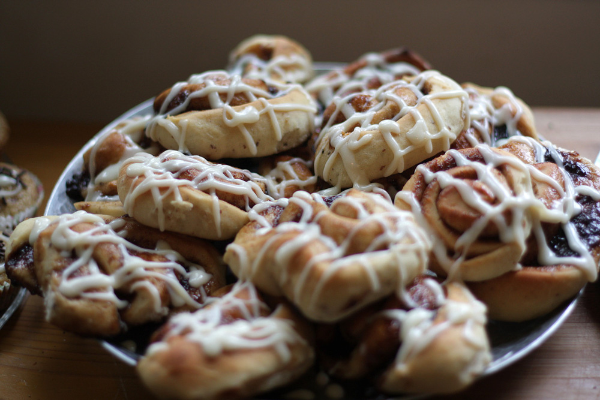
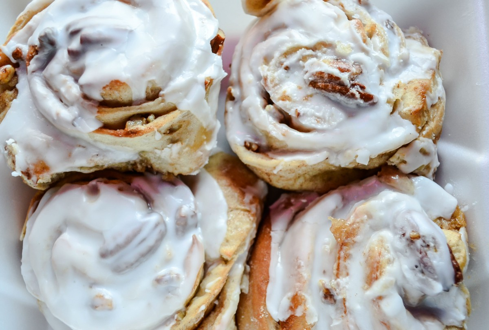

# SSUI Homework 3

**Notes**

Please use Chrome/Firefox as Edge does not support certain features used.

Formatted write-up [here](docs/assign3-ssui-writeup.pdf).

## Bun Bake Shop
This is a webpage designed for *Bun Bun Bake Shop*, a bakery that specializes in cinnamon rolls, from the famous classic to a variety of artisan flavors. The bakery is located in Pittsburgh, PA, but ships fresh rools to anywhere in the United States.

## Prototypes

### Wireframes

1. Homepage
   
2. Products
   
3. Item
   
4. Cart
   

### Digital Mockup
1. Homepage
   
2. Products
   
3. Item
   
4. Cart
   
5. Popup Cart
   

## Reflection
The project was challenging for me in two ways. Firstly, I do not have much experience in making high-quality digital mock-ups given the absence of libraries which are already available. Previously, when constructing mock-ups for previous assignment, I had access to the Android Material library and was able to drag and drop elements. In this assignment, such choices was not available and thus I had to scale down on my plans so accommodate for my lack of familiarity in design and in the JavaScript language.

Additionally, I had trouble getting the CSS styles to work as I wanted and thus there are still minor bugs in the final product.

I wanted to present a clean web interface and I decided on colours which related to baking (brown-ish) and chose the complement colour as a contrast colour. Other than these two colours, most of the page is in black and white. A large number of images were used to place emphasis on the product being sold.

## Bonus Features
The specification required being able to add items into the shopping cart and display an indicator on the number of items in the cart. In my implementation, clicking on the shopping cart icon shows the current items on the shopping cart and the cart will update with addition of more items. The button at the bottom of the cart allows users to navigate to the main shopping cart page which will allow them to modify their cart and checkout. Unfortunately, this feature is buggy as I cannot resolve the problem of faulty placement of this overlay. 

Possible extensions include allowing users to delete items in the pop-up shopping cart, as well as group items of the same type together instead of having them stack as different orders.

## Resources Used

1. Images (labelled reuse with modifications)

   
   Retrieved from Wikipedia https://upload.wikimedia.org/wikipedia/commons/3/3b/Cinnamon_rolls_from_above%2C_April_2009.jpg on 28 September 2017

   
   Retrieved from Wikipedia https://commons.wikimedia.org/wiki/File:Johns_Inc_Cinnamon_Rolls.jpg on 28 September 2017

   
   Retrieved from Pixabay https://cdn.pixabay.com/photo/2016/12/09/14/40/cinnamon-1894991_1280.jpg on 28 September 2017

   
   Retrieved from Pixabay https://cdn.pixabay.com/photo/2016/07/02/02/26/buns-1492328_1280.jpg on 28 September 2017

   
   Retrieved from pxhere https://pxhere.com/en/photo/1084511

   
   Retrieved from pixabay https://pixabay.com/en/food-pizza-roll-baked-712667/

   
   Retrieved from Wikipedia https://upload.wikimedia.org/wikipedia/commons/3/32/Vegan-cinnamon-rolls_%2811514387276%29.jpg

   
   Retrieved from Flicker https://c2.staticflickr.com/4/3949/15085119054_f4a6f695f2_b.jpg

   
   Retrieved from Wikipedia https://upload.wikimedia.org/wikipedia/commons/9/96/Cinnamon_rolls_for_breakfast%2C_December_2007.jpg

   
   Retrieved from pxhere https://pxhere.com/en/photo/878968

   
   Retrieved from Wikipedia https://upload.wikimedia.org/wikipedia/commons/e/e6/Vegan_Pumpkin_Cinnamon_rolls_%285159613455%29.jpg

   
   Retrieved from Wikipedia https://upload.wikimedia.org/wikipedia/commons/d/d6/Caramel_pecan_sticky_buns_on_wire_rack.jpg

   
   Retrieved from Wikipedia https://upload.wikimedia.org/wikipedia/commons/8/87/Cinnamon_roll_buns_fresh_from_the_oven%2C_March_2010.jpg

   
   Retrieved from Wikipedia https://pxhere.com/en/photo/34989

   
   Retrieved from Wikipedia https://upload.wikimedia.org/wikipedia/commons/thumb/a/a0/Cinnamon_rolls_in_baking_tray%2C_April_2009.jpg/640px-Cinnamon_rolls_in_baking_tray%2C_April_2009.jpg

   
   Retrieved from pixabay https://pixabay.com/en/cake-cream-strawberry-dessert-219595/

   
   Retrieved from pixabay https://pixabay.com/en/bake-baked-bakery-biscuit-cake-1841145/

   
   Retrieved from pixabay https://pixabay.com/en/cinnamon-rolls-pastry-homemade-1079584/

   
   Retrieved from Wikipedia https://upload.wikimedia.org/wikipedia/commons/2/25/Saturday_night_fever_-_cinnamon_buns.jpg
   
2. Font Awesome (by Dave Gandy) icon pack

   Retrieved from http://fontawesome.io/

